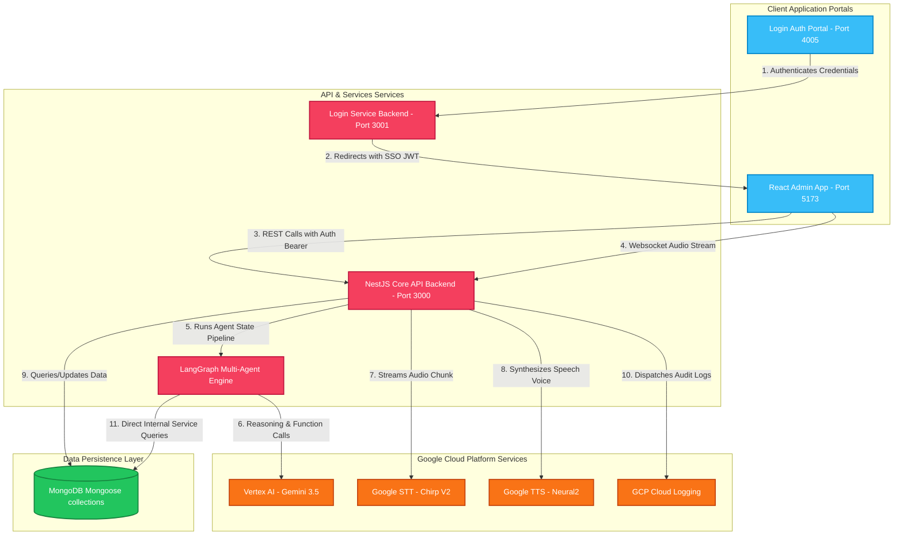
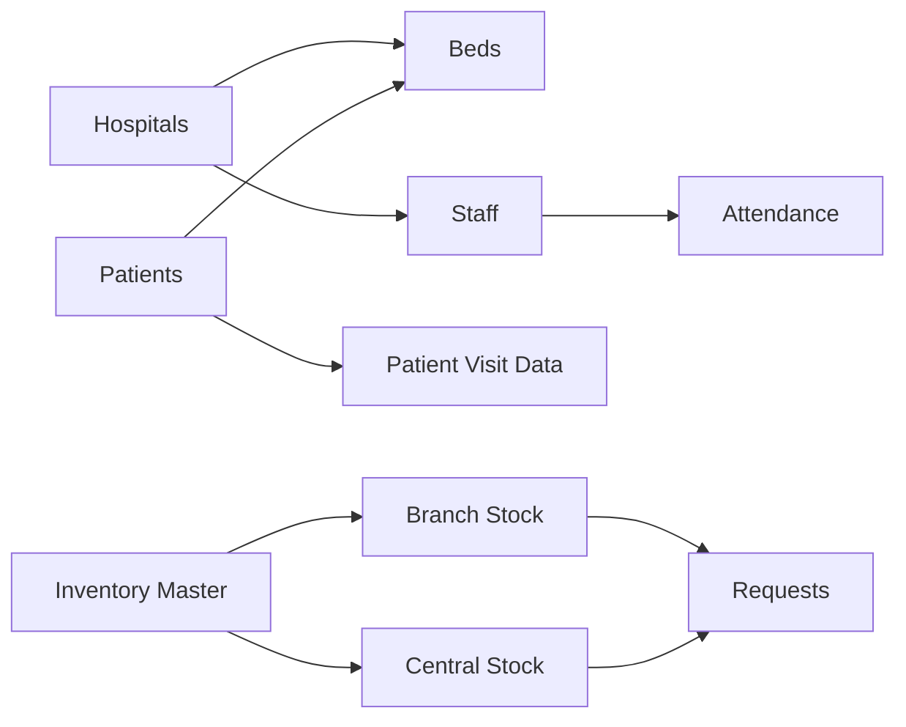
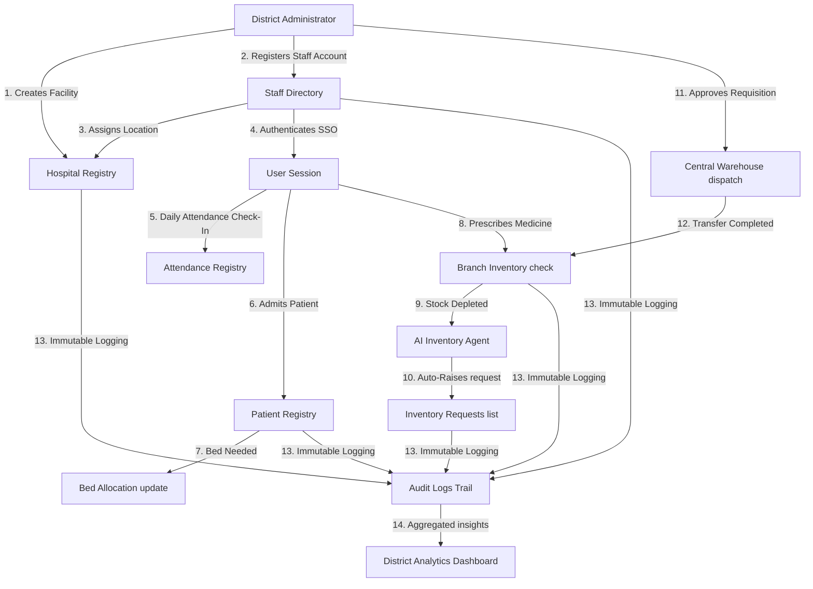
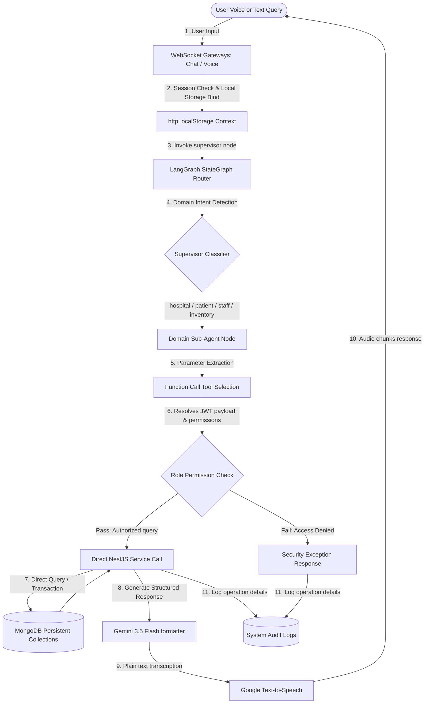
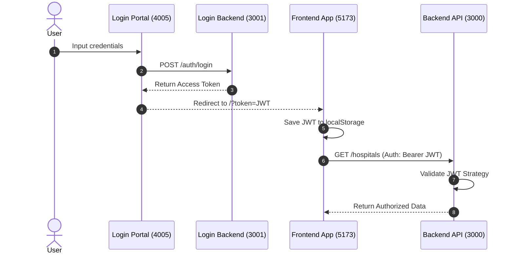
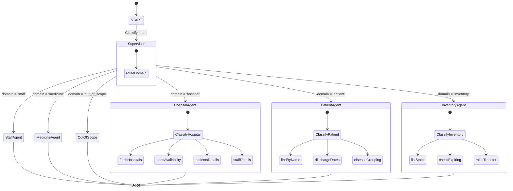
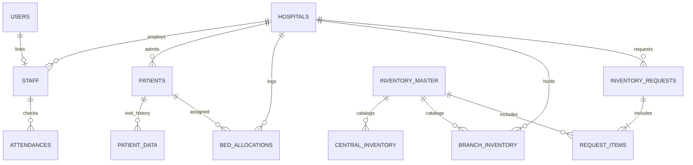
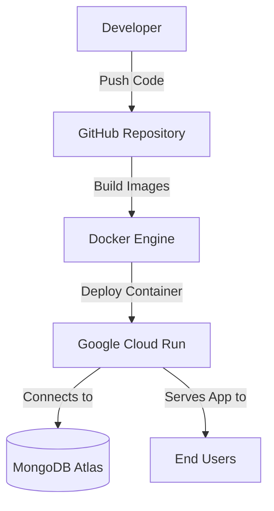

# Government Health Connect (GHC)

GHC is an enterprise-grade cloud-native public health management platform designed to modernize and synchronize public healthcare administration across Primary Health Centres (PHCs), Community Health Centres (CHCs), and District Hospitals.

[](https://nestjs.com/)
[](https://react.dev/)
[](https://www.mongodb.com/)
[](https://cloud.google.com/vertex-ai)
[](https://www.docker.com/)
[](https://www.i18next.com/)

---

## Executive Summary

> [!NOTE]
> **Government Health Connect (GHC)** is a unified healthcare management ecosystem built for government stakeholders, district administrators, and clinical staff. GHC consolidates fragmented medical operations—patient admissions, bed allocations, staff tracking, and pharmaceutical supply chains—into a single secure, role-aware cloud platform. By combining real-time dashboards, an AI-powered conversational voice assistant (via LangGraph and Google Vertex AI), and dynamic inventory redistribution, GHC eliminates manual delays, prevents critical medicine stockouts, and guarantees digital accessibility for rural healthcare workers.

### Project Highlights
| Category | Technology / Capability | Key Use Case / Description |
| :--- | :--- | :--- |
| **Frontend** | React + Vite | Clean, responsive Single Page Application dashboard interfaces |
| **Backend** | NestJS | Modular enterprise server API routes and WebSocket controllers |
| **Database** | MongoDB | Highly scalable operational document storage via Mongoose |
| **AI Engine** | LangGraph + Vertex AI | Multi-agent state machines routing conversational workflows |
| **Cloud Platforms** | Google Cloud | Hosting resources, Vertex models, and speech engines |
| **Authentication** | Federated JWT | Single Sign-On (SSO) micro-frontend authorization redirects |
| **Deployment** | Docker Compose | Containerized local and cloud build orchestration |
| **Monitoring** | Google Cloud Logging | Enterprise application logging and audit histories |
| **Notifications** | SMTP + Twilio SMS | Transactional HTML layouts and SMS text dispatches |
| **Localization** | 7 Supported Languages | English, Hindi, Telugu, Bengali, Kannada, Tamil, Gujarati |

### Project Modules Overview
```
Government Health Connect (GHC)
├── Authentication (JWT & SSO gateway)
├── Dashboard (Widgets, alarms, metrics)
├── Hospital Management (Tree hierarchies & equipment lists)
├── Staff Management (Designations, license keys, profiles)
├── Patient Management (Demographics & visit histories)
├── Bed Management (Live bed capacity check & allocations)
├── Inventory
│   ├── Inventory Master (Central cataloging)
│   ├── Central Inventory (Central stock tracking)
│   ├── Branch Inventory (Batch-specific local balances)
│   ├── Requests (Approval workflow statuses)
│   └── Transactions (Audit transaction logs)
├── AI Agent (Chat / Voice LangGraph nodes & tools)
├── Analytics (AI redistribution matching)
├── Reports (SVG charts & trends)
├── Notifications (Email templates & Twilio dispatches)
└── Audit Logs (Immutable security logs)
```

---

## Why Government Health Connect?

| Current Challenge in Public Healthcare | How GHC Solves It | Implemented System Component |
| :--- | :--- | :--- |
| **Paper-Based Doctor Attendance**: Inability to track if rural doctors are physically on-duty at community clinics. | **Daily Check-In Gateway**: Digital check-in logs with daily compound key uniqueness to prevent check-in fraud. | `AttendanceModule` & check-in UI |
| **Medicine Stockouts & Expiry Waste**: Vital drugs run out at one clinic while expiring unused at another. | **AI Supply Redistribution**: Monitors threshold levels, alerts admins of stockouts, and suggests redistributing surplus stock from nearby clinics. | `AIInventoryAnalytics` tab & stockout tools |
| **Manual & Ambiguous Requisitions**: Delayed approvals for restocking due to manual paperwork. | **Autonomous AI-Raised Requests**: Chatbot audits stock levels and raises central inventory requests automatically. | LangGraph Inventory agent |
| **Bed Shortage Mismatches**: Incoming patients are turned away because doctors can't see current bed availability. | **Live Bed Tracking**: Admissions decrement facility capacity in real-time, displaying occupancy rates instantly. | `BedAllocation` & hospital details page |
| **Fragmented Systems & Siloed Data**: Separate login portals, isolated databases, and manual reports. | **SSO Federated Architecture**: Single sign-on gateway with JWT-based propagation to secure all modules. | `login_backend` & `login_frontend` |
| **No Centralized Monitoring**: District administrators cannot oversee daily logs, transaction history, or analytics. | **Audit Trails & Dynamic Reports**: Real-time admin views of system logs, patient visit counts, and chart dashboards. | `/audits` & reports page |

---

## Platform Impact Metrics

* 🏢 **Multi-Hospital Ready**: Dynamic hierarchical modeling linking primary clinics (PHCs) to main community health centers (CHCs).
* 🧠 **AI-Powered Operations**: Google Vertex AI `gemini-3.5-flash` powering clinical visits, safety alerts, and speech interfaces.
* 📦 **Centralized Administration**: Distributes medical catalogues and dispatches stock from central warehouses to local branches.
* 👮 **Role-Aware Security**: 8 distinct roles mapped to custom frontend views and API routes.
* 🌐 **Dynamic RBAC & Hospital Isolation**: Local doctors and staff are restricted to their assigned branch data.
* 📈 **Real-Time Dashboards**: SVG charts mapping patient visit counts and bed allocations.
* 🗣️ **Multi-Language Support**: Complete internationalization for English, Hindi, Telugu, Bengali, Kannada, Tamil, and Gujarati.

---

## Table of Contents
1. [Project Overview](#1-project-overview)
2. [Key Features](#2-key-features)
3. [AI Capabilities](#3-ai-capabilities)
4. [Technology Stack](#4-technology-stack)
5. [Architecture](#5-architecture)
6. [Folder Structure](#6-folder-structure)
7. [Project Modules](#7-project-modules)
8. [Authentication](#8-authentication)
9. [Authorization](#9-authorization)
10. [AI Architecture](#10-ai-architecture)
11. [Database Design](#11-database-design)
12. [API Design](#12-api-design)
13. [Shared Components](#13-shared-components)
14. [Environment Variables](#14-environment-variables)
15. [Installation](#15-installation)
16. [Docker](#16-docker)
17. [Running the Project](#17-running-the-project)
18. [Deployment](#18-deployment)
19. [Logging & Monitoring](#19-logging-&-monitoring)
20. [Notifications](#20-notifications)
21. [Security](#21-security)
22. [Performance](#22-performance)
23. [Government Impact](#government-impact)
24. [Future Roadmap](#24-future-roadmap)
25. [What Makes GHC Different?](#what-makes-ghc-different)
26. [Demo](#25-demo)
27. [Contributing](#27-contributing)
28. [License](#28-license)
29. [Contact](#28-contact)

---

## 1. Project Overview

### Perspective & Modernization Agenda
Modernizing public healthcare delivery requires robust coordination between frontline facilities and central administration. Traditionally, rural health networks (PHCs and CHCs) operate as data silos, relying on paper registers for patient records, phone calls for inventory rebalancing, and physical logbooks for doctor attendance. This fragmentation causes critical stockouts of life-saving medicines, bed shortage mismatches during emergencies, lack of clinical accountability, and operational blind spots for state administrators.

**Government Health Connect (GHC)** resolves these gaps by establishing a secure, unified digital nervous system. It acts as an operational platform connecting remote facilities, staff schedules, bed occupancies, and medical inventories into a single real-time dashboard. 

```
  ┌─────────────────────────────────────────────────────────────┐
  │                 GHC CENTRAL CLOUD PLATFORM                 │
  └──────────────────────────────┬──────────────────────────────┘
                                 │
         ┌───────────────────────┼───────────────────────┐
         ▼                       ▼                       ▼
 ┌───────────────┐       ┌───────────────┐       ┌───────────────┐
 │  District HQ  │       │   Rural CHC   │       │   Local PHC   │
 │ (Admin Views) │       │ (Doctor Logs) │       │ (Nurse Tools) │
 └───────────────┘       └───────────────┘       └───────────────┘
```

### Vision & Objectives
* **Eliminate Medical Stockouts**: Enable predictive supply chain routing via automated branch-to-branch inventory transfers.
* **Optimize Resource Distribution**: Provide live bed-occupancy visibility and clinic-level medical officer tracking.
* **Enhance Decision Support**: Deploy AI capabilities to forecast patient footfalls and assist clinical staff with prescription safety checks.
* **Promote Rural Accessibility**: Offer native multilingual support (English, Hindi, Telugu, Bengali, Kannada, Tamil, Gujarati) to ensure front-line health workers can interact with GHC using text or voice.

---

## 2. Key Features

GHC implements a comprehensive suite of operational modules:

| Module | Core Functionality | Stakeholder Business Value |
| :--- | :--- | :--- |
| **Authentication** | Single Sign-On (SSO) authentication portal with OTP recovery flow. | Protects health records (Aadhaar data) with JWT-based access. |
| **Authorization** | Strict Role-Based Access Control (RBAC) and data isolation. | Frontline clinics only see their own records; central Admins view aggregated metrics. |
| **Hospitals** | Manage facility classification (PHC/CHC), equipment metrics (OT/X-Ray), and parenting relationships. | Maps secondary community health centers to primary rural clinics. |
| **Staff** | Track medical registration details, shift availability, specialization, and check-in statuses. | Enforces medical staff attendance tracking and clinical duty allocation. |
| **Patients** | Patient onboarding, Aadhaar format validation, demographic tracking, and medical history. | Streamlines admissions and creates permanent digital health cards. |
| **Beds** | Real-time bed allocation and release logging. | Prevents patient transfers to facilities lacking physical bed capacity. |
| **Inventory** | Master catalog registry, central warehouse balances, and localized batch-specific branch stock details. | Controls medicine waste and checks drug expiration dates. |
| **Requests & Transfers** | Requisition generation, auto-replenishment, and branch-to-branch stock transfers. | Eliminates supply shortages without manual red-tape. |
| **AI Inventory Analytics** | Stockout alarms, demand curves, and surplus redistribution recommenders. | Optimizes medical budget allocations. |
| **Diagnostic Tests** | Test lists, codes, sample requirements, and lab statuses. | Standardizes diagnostics reporting. |
| **Audit Logs** | Immutable system logs for auth failures, data updates, and allocations. | Secures regulatory and audit compliance. |
| **Reports** | SVG charts mapping visit rates, bed occupancy loads, and clinical staff ratios. | Provides administrative oversight. |

---

## 3. AI Capabilities

GHC features an advanced AI conversational and analytical engine powered by **Google Cloud Vertex AI** (using `gemini-3.5-flash`):

```
                       ┌──────────────────────┐
                       │  User Input (Voice)  │
                       └──────────┬───────────┘
                                  ▼
                    ┌────────────────────────────┐
                    │ Speech-to-Text (Chirp v2)  │
                    └──────────┬─────────────────┘
                                  ▼
                    ┌────────────────────────────┐
                    │ Multi-Agent Supervisor     │
                    │   (Graph Domain Router)    │
                    └──────────┬─────────────────┘
                               │
       ┌───────────────────────┼───────────────────────┐
       ▼                       ▼                       ▼
┌──────────────┐        ┌──────────────┐        ┌──────────────┐
│  Hospital    │        │  Patient     │        │  Inventory   │
│  Sub-agent   │        │  Sub-agent   │        │  Sub-agent   │
└──────┬───────┘        └──────┬───────┘        └──────┬───────┘
       └───────────────────────┼───────────────────────┘
                               ▼
                    ┌────────────────────────────┐
                    │    Direct Service Call     │
                    └──────────┬─────────────────┘
                               ▼
                    ┌────────────────────────────┐
                    │  Text-to-Speech (Neural2)  │
                    └────────────────────────────┘
```

* **LangGraph Multi-Agent Supervisor Pattern**: A top-level supervisor node classifies the user's intent and routes to a domain sub-graph (Hospital, Patient, Medicine, Staff, or Inventory).
* **Role and Permission-Aware AI**: The agent decodes the user's JWT from `httpLocalStorage`. When a doctor queries *"Show patients"*, the tool automatically restricts the database query to their assigned hospital without exposing other branches.
* **Dynamic Function Calling**: 50 specialized tools bind natural language queries directly to underlying NestJS services.
* **Analytical AI**:
  * **Clinical Suggestions**: Analyzes symptoms (e.g. *"Severe headache and high fever"*) to suggest vitals to check and potential diagnoses.
  * **Prescription Warnings**: Evaluates drug interactions and schedules post-meal reminders during the prescribing flow.
  * **Stock Redistribution Recommender**: Computes stock imbalances and suggests redistribution between neighboring PHCs.

### Example AI Commands
* 📦 *"Audit my inventory for low stock medicines"* (Auto-checks stock thresholds and generates requests for out-of-stock items)
* 🛏️ *"Fetch beds availability for King George Hospital"* (Checks live total and available bed configurations)
* 🧑🏽‍⚕️ *"Who is the medical officer incharge of PHC Kommadi?"* (Queries facility detail directory)
* 🧑🏽 *"Search for patient named Rahul"* (Resolves patient card matching the name)
* 🩺 *"List available pediatricians in all hospitals"* (Filters staff registers by specialization)
* 🩺 *"Find hospitals that have a cardiologist"* (Identifies facilities employing specialists)

---

## 4. Technology Stack

### Core Stack
| Layer | Technology | Key Use Case |
| :--- | :--- | :--- |
| **Frontend** | React | User dashboard interfaces |
| **Frontend Tooling** | Vite | Client bundling and proxying |
| **Backend** | NestJS | Modular backend controller services |
| **Database** | MongoDB (Mongoose) | Operations database storage |
| **AI Engine** | LangGraph & LangChain | Supervisor graphs, node logic, ReAct tools |
| **AI LLM** | Google Vertex AI | Reasoning, classification, and clinical analysis |
| **STT** | Google Cloud Speech-to-Text | Streaming audio transcribing |
| **TTS** | Google Cloud Text-to-Speech | Multilingual audio output synthesis |

### Libraries & Tooling
* **Styling**: TailwindCSS, Lucide React, Clsx
* **Localization**: i18next, react-i18next
* **Websockets**: socket.io, socket.io-client
* **SMTP Server**: Nodemailer for email alerts
* **SMS Gateway**: Twilio for emergency alerts
* **Language Runtime**: Node.js

---

## 5. Architecture



---

## 6. Folder Structure

```
c:/Users/Naveen/ghc/
├── backend/                        # NestJS Core Backend API
│   ├── src/
│   │   ├── Agents/                 # LangGraph Multi-Agent Supervisor Engine
│   │   ├── attendance/             # Daily clock-in & status checks
│   │   ├── audit-logs/             # Immutable transaction audit trail
│   │   ├── auth/                   # JWT guards, passport strategies
│   │   ├── chat-gateway/           # WebSocket text chat handlers
│   │   ├── common/                 # Global enums, interceptors, async context
│   │   ├── diagnostic-tests/       # Lab test directories
│   │   ├── google/                 # Vertex, STT, TTS configurations
│   │   ├── hospitals/              # Facility structures, bed tracking
│   │   ├── inventory/              # Logistics, requests, analytics
│   │   ├── locations/              # District/State mappings
│   │   ├── notifications/          # Email wrappers, SMS Twilio pipelines
│   │   ├── patient-data/           # Patient clinical histories
│   │   ├── patients/               # Patient demographic records
│   │   ├── reports/                # SVG analytical dashboards
│   │   ├── repositories/           # Mongoose repositories
│   │   ├── schemas/                # Mongoose database models
│   │   └── voice-gateway/          # Real-time WebSocket audio processing
│   ├── Dockerfile
│   └── tsconfig.json
├── frontend/                       # Vite + React Admin Frontend
│   ├── src/
│   │   ├── components/             # Reusable UI cards, inputs, tables
│   │   ├── context/                # AppState, Theme, Inventory providers
│   │   ├── i18n/                   # Localized language translation files
│   │   ├── pages/                  # Dashboard, Hospitals, Medicines list views
│   │   └── types/                  # Global TypeScript Interfaces
│   ├── index.html
│   └── vite.config.ts
├── login_backend/                  # Authentication Backend micro-service
├── login_frontend/                 # Authentication Portal UI (SSO portal)
└── docker-compose.yml              # Central multi-container compose file
```

### Core Backend Modules & Responsibilities
* **`Agents`**: Formulates the StateGraph layout, routing logic, prompt templates, and ReAct tools linking natural language queries to the database.
* **`hospitals`**: Manages facility metadata, parent-child community hub configurations, Operating Theatre (OT)/X-Ray equipment checklists, and physical bed assignments.
* **`patients` & `patient-data`**: Stores demographic info, Aadhaar validation structures, clinical visits, vital histories, and drug prescriptions.
* **`staff` & `attendance`**: Maintains staff designations, specialization details, license numbers, and unique daily clock-in records.
* **`inventory`**: Handles central master catalog assets, central warehouse stock, batch-specific branch balances, requisitions, and redistribution algorithms.
* **`notifications`**: Dispatches transaction receipts via SMTP layouts and emergency shortage alerts via Twilio SMS.
* **`reports`**: Formulates dashboard telemetry parsing database records into SVG visual charts.
* **`common`**: Manages global exception handlers, pagination wrappers, custom interceptors, and `httpLocalStorage` contexts.

---

## 7. Project Modules



### 7a. Hospital Management Module
* **Responsibilities**: Manages healthcare facility metadata, classification (PHC community clinics vs CHC community health hubs), state/district region codes, parent-child linkages, and infrastructure checklists (Operating Theatres, X-Ray modules, and Ambulances).
* **Dependencies**: Mongoose `HospitalRepository`, `LocationsService`.
* **Business Flow**: Admins register a parent CHC. Subordinate PHCs are registered referencing the parent CHC ID, enabling hierarchical inventory tracking.

### 7b. Staff & Attendance Module
* **Responsibilities**: Handles professional staff profiles, specialization categories, licensing registration codes, duty shifts, and attendance clock-ins.
* **Dependencies**: `UsersModule`, `AttendanceRepository`.
* **Business Flow**: Medical staff log in, navigate to attendance, and clock-in. The system records the timestamp and locks their attendance status for the day, preventing duplicate check-ins.

### 7c. Patient & Bed Management Module
* **Responsibilities**: Manages patient onboarding details, Aadhaar formatting checks, bed requirements, live bed status indicators, and discharge dates.
* **Dependencies**: `HospitalsModule`, `BedAllocationRepository`.
* **Business Flow**: When a patient visits, if the doctor checks **Bed Required**, the system allocates a bed. This updates the live bed count for that facility and adds a record to the `BedAllocation` audit history.

### 7d. Inventory & Supply Chain Module
* **Responsibilities**: Tracks the catalog of medicines, central warehouse stock, branch batch stock levels, requisition approvals, and transfer dispatch operations.
* **Dependencies**: `NotificationsModule`, `AuditLogsModule`.
* **Business Flow**: Frontline clinics experiencing shortages submit an inventory transfer request. GHC fires a notification email to the central manager. Once approved, the items are deducted from the central warehouse and dispatched to the branch, logging transactions in the audit trail.

---

## End-to-End Business Workflow



---

## AI Request Lifecycle



> [!IMPORTANT]
> **Direct Service Integration**:
> To guarantee speed, avoid network latencies, and prevent authorization recursion loops, the GHC AI Agent invokes underlying NestJS core services directly. It bypasses internal HTTP loops, calling compiled database repository methods inside the server container. All database mutations inherit the user's local request transaction context to maintain data integrity.

---

## 8. Authentication

GHC implements a Single Sign-On (SSO) micro-frontend authentication architecture:



* **Token Format**: Standard HS256 JWT containing `sub` (userId), `username`, and `role`.
* **Token Expiry**: Configured via `JWT_EXPIRES_IN=60m`.
* **Expiration Handling**: `main.tsx` schedules an automatic logout `setTimeout` matching the remaining token lifetime.

---

## 9. Authorization

GHC enforces strict authorization limits to protect citizen records and maintain operational compliance:

### Role Permissions Matrix
| System Action | Admin | Doctor | Nurse | Receptionist | Pharmacist | Lab Tech | Compounder / Cashier |
| :--- | :---: | :---: | :---: | :---: | :---: | :---: | :---: |
| **Register Hospital** | ✓ | ✗ | ✗ | ✗ | ✗ | ✗ | ✗ |
| **Manage Staff** | ✓ | ✗ | ✗ | ✗ | ✗ | ✗ | ✗ |
| **View Audit Logs** | ✓ | ✗ | ✗ | ✗ | ✗ | ✗ | ✗ |
| **Manage Transfers** | ✓ | ✗ | ✗ | ✗ | ✗ | ✗ | ✗ |
| **Register Patient** | ✓ | ✓ | ✓ | ✓ | ✗ | ✗ | ✗ |
| **Bed Allocation** | ✓ | ✓ | ✓ | ✓ | ✗ | ✗ | ✗ |
| **Check Branch Stock** | ✓ | ✓ | ✓ | ✓ | ✓ | ✓ | ✓ |
| **Raise Transfer Request**| ✓ | ✓ | ✓ | ✗ | ✓ | ✓ | ✓ |
| **Approve Requisitions** | ✓ | ✗ | ✗ | ✗ | ✗ | ✗ | ✗ |
| **Manage Diagnostics** | ✓ | ✓ | ✓ | ✗ | ✗ | ✓ | ✗ |
| **AI Inventory Analytics**| ✓ | ✗ | ✗ | ✗ | ✗ | ✗ | ✗ |

### Multi-Level Enforcement
* **Frontend Access Control**: Restricted sidebar paths (`/transfers`, `/audits`, `/ai-analytics`) are filtered using active user scopes, preventing non-admins from rendering the administration tabs.
* **Core API Guards**: All backend controller entrypoints are decorated with NestJS `@UseGuards(JwtAuthGuard)`. The controllers query `usersService.getAssignedHospitalId` to isolate DB filters to the doctor's assigned hospital ID, blocking cross-facility requests.
* **AI Tool Restrictions**: AI Tools execute within the request context using `httpLocalStorage`. The tools decode the JWT payload to check role constraints. If a doctor asks to view another facility's records, the tools block execution and return an access denied error.

---

## 10. AI Architecture

GHC's conversational agent is built on a **LangGraph state machine graph** to handle context switches:



### Direct Database Queries vs HTTP Requests
Within AI tools (like `hospital.tools.ts` and `inventory.tools.ts`), **direct Mongoose repository/service queries are used instead of HTTP requests**.
* **Performance**: Skips HTTP network overhead and parsing lag, responding in under 100ms.
* **Security & Context**: Direct service integration retrieves transaction details securely within the database container.
* **Atomic Consistency**: Resolves database lookups and updates within the same execution context.

---

## 11. Database Design



### Core Collections Overview

#### `hospitals`
* `name`: String (Required)
* `type`: Enum `FacilityType` (PHC/CHC)
* `address`: String
* `city`: Number (District code)
* `state`: Number (State code)
* `totalBeds` / `availableBeds`: Number
* `parentCHCId`: ObjectId (ref Hospital)
* `medicalOfficer`: String
* `specialists`: String[]
* `hasOT` / `hasXRay` / `hasAmbulance`: Boolean
* `hospitalId`: String (Index)

#### `staff`
* `userId`: ObjectId (ref User)
* `firstName` / `lastName` / `displayName`: String
* `mobileNumber`: String
* `department`: Enum `Department`
* `specialization`: String
* `hospitalId`: ObjectId (ref Hospital)
* `isMedicalIncharge`: Boolean

#### `patients`
* `name`: String
* `age`: Number
* `gender`: String
* `bloodGroup`: String
* `aadhaarNumber`: String (Unique, Index)
* `hospitalId`: ObjectId (ref Hospital)
* `bedRequired`: Boolean

#### `patientData`
* `patientId`: ObjectId (ref Patient)
* `problem`: String
* `visitDate`: Date
* `medicines`: Array of `{ name: String, quantity: Number, days: Number, sessions: String[] }`
* `doctor` / `nurse`: String
* `recommendedTests`: String[]

#### `inventoryrequests`
* `requestNumber`: String (Unique)
* `branchId`: ObjectId (ref Hospital)
* `fromBranchId`: ObjectId (ref Hospital)
* `status`: Enum `RequestStatus` (Pending/Approved/Rejected/Partial)
* `items`: Array of `{ itemId: ref InventoryMaster, requestedQty: Number, approvedQty: Number, issuedQty: Number }`

---

## 12. API Design

GHC APIs follow standard REST conventions:

* **Prefix**: `/` (e.g. `/hospitals`, `/patients`)
* **Headers**: `Authorization: Bearer <JWT>`
* **Validation**: NestJS `ValidationPipe` validates incoming request bodies using `class-validator` DTOs.
* **Pagination**: Enforced using structured utility query keys:
  `POST /patients` -> `{ page: 1, pageSize: 10, search: 'Rahul' }`
  Response format:
  ```json
  {
    "data": [...],
    "total": 45,
    "page": 1,
    "pageSize": 10
  }
  ```
* **Error Handling**: `HttpExceptionFilter` transforms system errors into unified client payloads:
  ```json
  {
    "statusCode": 403,
    "message": "Access denied to this patient record",
    "error": "Forbidden"
  }
  ```

---

## 13. Shared Components

* **`httpLocalStorage`**: Uses NestJS `AsyncLocalStorage` to store context tokens and language preferences, sharing user auth parameters across all downstream service layers.
* **`httpClient`**: Global, context-aware Axios helper that extracts bearer authorization details from local request storage to query services.
* **`LocationsService`**: Centralized service mapping state and district numeric database codes to regional names.
* **`buildPaginatedResponse`**: Formats database output records into paginated payloads.

---

## 14. Environment Variables

Create a `.env` file in the `backend` and `login_backend` directories:

### Backend `.env` Template
```ini
MONGODB_URI=mongodb+srv://<user>:<password>@cluster.mongodb.net/healthcare
PORT=3000
API_BASE_URL=http://localhost:3000
JWT_SECRET=your_jwt_signing_secret_key

# Google Cloud Integrations
GEMINI_API_KEY=AIzaSyA...
GOOGLE_CLOUD_PROJECT=your-project-id
GOOGLE_CLOUD_LOCATION=global
GOOGLE_CLOUD_LOCATION_IN=asia-south1
GOOGLE_CLOUD_STT_RECOGNIZER_ID=lyreai

# Email Notifications (Optional)
SMTP_HOST=smtp.gmail.com
SMTP_PORT=587
SMTP_USER=alerts@ghc.gov.in
SMTP_PASS=app_password_here
SMTP_FROM=GHC Alerts <alerts@ghc.gov.in>
LOGO_URL=https://storage.googleapis.com/ghcai-medsynai/logoghc.png

# Twilio SMS Alerts (Optional)
TWILIO_ACCOUNT_SID=AC...
TWILIO_AUTH_TOKEN=auth_token_here
TWILIO_PHONE_NUMBER=+15172009437
```

### Login Backend `.env` Template
```ini
MONGODB_URI=mongodb+srv://<user>:<password>@cluster.mongodb.net/healthcare
PORT=3001
JWT_SECRET=your_jwt_signing_secret_key
JWT_EXPIRES_IN=60m
LOGIN_FRONTEND_URL=http://localhost:4005
```

---

## 15. Installation

### Prerequisites
* Install **Node.js** (v22.x or later)
* Install **Docker** & **Docker Compose**
* Obtain a **Gemini API Key** from Google AI Studio

### Step-by-Step Setup
1. **Clone the Repository**:
   ```bash
   git clone https://github.com/your-repo/ghc.git
   cd ghc
   ```
2. **Configure Environments**:
   Copy `.env.example` to `.env` in both folders:
   ```bash
   cp backend/.env.example backend/.env
   cp login_backend/.env.example login_backend/.env
   ```
   Fill in database connection details and API keys.

3. **Install Core Project Dependencies**:
   ```bash
   # Root orchestration dependencies
   npm install
   ```

---

## 16. Docker

GHC deploys a containerized environment via Docker Compose:

### Compose Service Overview
* **`ghc-backend`**: Core NestJS API container, exposing port `3000`. Mounts `/backend` volume in development.
* **`ghc-login-backend`**: SSO Auth Backend container, exposing port `3001`.
* **`ghc-frontend`**: React Admin panel client container, running Vite server on port `5173`.
* **`ghc-login-frontend`**: Authentication portal container, running on port `4005`.

### Deployment Commands
* **Start all services**:
   ```bash
   docker compose up -d
   ```
* **Rebuild containers**:
   ```bash
   docker compose build --no-cache
   ```
* **View application logs**:
   ```bash
   docker compose logs -f
   ```
* **Stop all services**:
   ```bash
   docker compose down
   ```

---

## 17. Running the Project

### Local Development
To run GHC locally without Docker, start backend and login services individually:

1. **Start Login Backend**:
   ```bash
   cd login_backend && npm run start:dev
   ```
2. **Start Core API Backend**:
   ```bash
   cd backend && npm run start:dev
   ```
3. **Start Login Portal**:
   ```bash
   cd login_frontend && npm run dev
   ```
4. **Start Main Portal**:
   ```bash
   cd frontend && npm run dev
   ```

### Production Build
Validate build configurations:
```bash
# Frontend Build
cd frontend && npm run build-prod

# Core Backend Build
cd backend && npm run build
```

---

## 18. Deployment

GHC is designed for containerized cloud deployment:

### Google Cloud Run Deployment
Deploy the backend services directly to Cloud Run:
```bash
# Deploy Core API Backend
cd backend
gcloud run deploy ghc-backend \
  --source . \
  --platform managed \
  --region asia-south1 \
  --allow-unauthenticated
```

### Deployment Workflow


---

## 19. Logging & Monitoring

* **GCP Cloud Logging Integration**: GHC routes API error traces and operational logs to Google Cloud Logging when deployed in production.
* **Database Query Performance Monitoring**: MongoDB indexes track operations to flag slow database queries.
* **Immutable Audit Trail**: All administrative inventory transactions, user logins, and patient discharges generate database records in the `auditlogs` collection.

---

## 20. Notifications

```
             ┌─────────────────────────┐
             │   Trigger Event         │
             │   (Inventory short)     │
             └────────────┬────────────┘
                          │
            ┌─────────────┴─────────────┐
            ├───────────────────────────┤
            ▼                           ▼
 ┌─────────────────────┐     ┌─────────────────────┐
 │ Nodemailer (SMTP)   │     │ Twilio SMS Gateway  │
 ├─────────────────────┤     ├─────────────────────┤
 │ HTML Email Template │     │ Urgent Shortage SMS │
 └─────────────────────┘     └─────────────────────┘
```

* **System Notifications**: Dispatches transactional alerts via Nodemailer using a branded HTML layout. Includes local logo hosting fallbacks for mail client rendering.
* **SMS Integrations**: Dispatches emergency shortages and doctor shift reassignments to mobile numbers via Twilio.

---

## 21. Security

* **JWT Verification**: Validates requests via JWT strategies.
* **Role Guards**: Frontend and backend routes restrict features using role-based access rules.
* **Data Isolation**: Multi-tenant database filters prevent medical staff from accessing other clinic records.
* **Cryptographic Hashing**: Hashes passwords using bcrypt (`rounds: 10`).

---

## 22. Performance

* **Paginated Responses**: Enforces limits on user and inventory lists to prevent performance lag.
* **Indexed Queries**: Employs compound indexes (e.g. `{ branchId: 1, itemId: 1, batchNo: 1 }` on `BranchInventory`) to keep queries under 50ms.
* **Static Asset Caching**: Employs client-side caching to reduce server load for static files.

---

## Government Impact

### Administrative Digitalization
Eliminates paper registers and physical duty logbooks by transitioning patient data, admissions, clinical walk-ins, and doctor attendance logs to a secure, role-restricted digital environment.

### Optimized Medical Supply Chains
Minimizes drug stockouts and saves logistics budgets at the sub-center level through rebalancing algorithms that identify excess inventories and match them to deficient branches.

### Real-Time Facility Transparency
Empowers district health commissioners and state directors with absolute oversight of bed occupancies, emergency operation setups (OT/X-Ray/Ambulances), and staff shifts in real-time.

### Multi-Language Accessibility
Enables local health workers and nurses to communicate directly with GHC using text or voice in major regional Indian languages, boosting digital adoption.

### Data-Driven Resource Planning
Provides administrators with the exact forecasting analytics required to make informed decisions on doctor schedules, medical budget allocation, and clinic equipment distributions.

---

## 24. Future Roadmap

### Feature Completion Matrix
| Feature / Module | Status | Type | Description |
| :--- | :--- | :--- | :--- |
| **Federated Login (SSO)** | ✅ Implemented | Core Security | Cross-portal auth, JWT token storage, OTP recovery flows. |
| **Hospital Directory** | ✅ Implemented | Core System | Facility hierarchy setups and parent-child CHC/PHC tree matching. |
| **Staff & Shifts Registry**| ✅ Implemented | Core System | Shift rosters, specializations, attendance tracking check-ins. |
| **Patient Admissions** | ✅ Implemented | Core System | Aadhaar validation, visit logs, live bed capacity allocation updates. |
| **Multi-Tier Inventory** | ✅ Implemented | Core System | Central warehouse and branch batch balances. |
| **Requisition Approvals** | ✅ Implemented | Core System | Transfer request flows (Pending/Approved/Rejected/Partial). |
| **Audit Trails** | ✅ Implemented | Core Security | Permanent transactional, clinical, and database logs. |
| **Nodemailer Alerts** | ✅ Implemented | Alerts | Automated HTML transaction receipts with logo fallbacks. |
| **Twilio SMS Alerts** | ✅ Implemented | Alerts | Critical stockouts and shift reassignment dispatches. |
| **LangGraph Agent** | ✅ Implemented | Conversational AI | 50 function tools executing direct service database queries. |
| **Cloud Logging** | ✅ Implemented | Infrastructure | GCloud monitoring integration for system telemetry. |
| **WhatsApp Integration** | 🚧 Planned | Future | Automated notification alerts sent directly to patient phones. |
| **Mobile Application** | 🚧 Planned | Future | Native Android/iOS layouts for field workers. |
| **IoT Telemetry Bed Weights**| 🚧 Planned | Future | Smart load sensors to track physical bed occupancy weight. |
| **Predictive Epidemiology** | 🚧 Planned | Future | Vertex AI prediction engines mapping regional outbreak clusters. |

---

## What Makes GHC Different?

* **AI-First Design**: The conversational agent isn't a bolt-on; it runs as a core graph pipeline handling daily operational requests.
* **Deep Function Calling**: 50 specialized tools bind chatbot queries directly to transactional code.
* **Zero-Trust AI Execution**: The AI engine cannot bypass RBAC checks since it is bound to the user's request token context.
* **Automatic Stock Balancing**: Active redistribution algorithms rebalance surplus stock between local centers.
* **Containerized Scalability**: Designed to deploy and scale instantly via Docker and Cloud Run.

---

## 26. Demo

### Seed Accounts
Log in via the portal (port `4005`) using these accounts:

* **District Admin**:
  * Username: `admin`
  * Password: `admin123`
* **Hospital Doctor (King George Hospital)**:
  * Username: `rukmesh`
  * Password: `admin123`

---

## 27. Contributing

1. **Branching Rules**: Create feature branches from `main` (e.g. `feature/your-feature`).
2. **Coding Standards**: Prettier and ESLint rules are enforced on commit. Compile the build locally before opening a pull request.

---

## 28. License

Distributed under the MIT License. See `LICENSE` for more information.

---

## 29. Contact

* **Project Owner**: Government Health Connect (GHC) Team
* **Email**: ghc.admin1@gmail.com
* **Repository**: [https://github.com/Ryuytyuu-Greseven/ghc](https://github.com/Ryuytyuu-Greseven/ghc)
